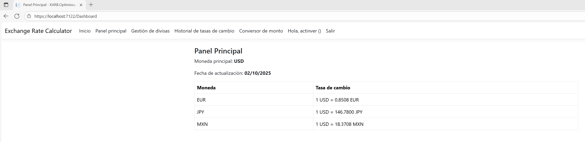
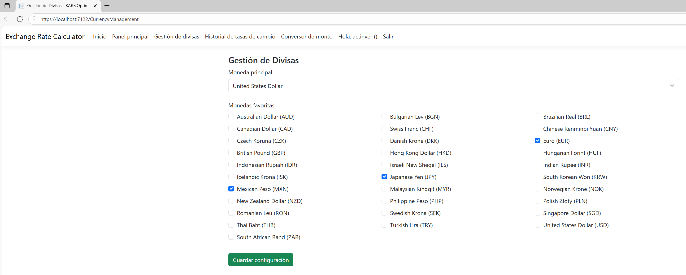
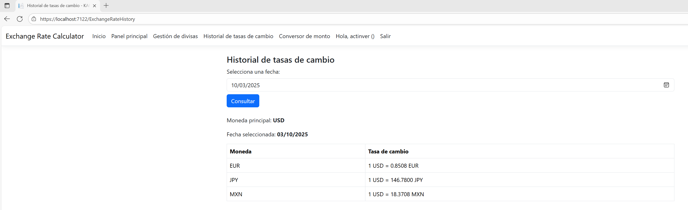
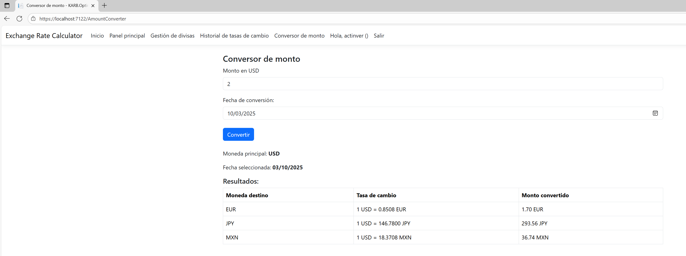

# Calculadora de tipo de cambio - ASP.NET Core MVC

Aplicación web para gestionar divisas, consultar tasas de cambio históricas y convertir montos. Desarrollada con ASP.NET Core MVC y Entity Framework Core.

## Funcionalidades

- Panel principal con tasas de cambio actualizadas.
- Conversor de montos entre moneda principal y favoritas.
- Historial de tasas de cambio por fecha seleccionada.
- Gestión de configuración de usuario (moneda principal y favoritas).
- Consumo de API externa para tasas de cambio (Frankfurter).

## Tecnologías utilizadas

- ASP.NET Core MVC
- Entity Framework Core (Code First)
- Razor Pages
- SQL Server
- Bootstrap 5
- API Frankfurter para tasas de cambio

## Instalación

1. Clona el repositorio:
        ```bash
        git clone https://github.com/KarimAbdel23/ExchangeRateCalculator.git
        cd ExchangeRateCalculator
2. Configura la cadena de conexión en appsettings.json (instancia y servidor).
        "ConnectionStrings": {
            "DefaultConnection": "Server=localhost\\myInstanceName;Database=ExchangeRateCalculatorDB;Trusted_Connection=True;Encrypt=True;TrustServerCertificate=True;"
        }
3. - Restaura dependencias
        dotnet restore
4. Ejecuta las migraciones:
        dotnet ef database update (o Update-Database en el Package Manager Console)
5. Inicia el proyecto:
        dotnet run

## Datos semilla
    Despues de realizar las migraciones se agregara el administrador como dato semilla
        nombre useuaio: actinver
        contraseña: admin123

## Autor

Desarrollado por Karim Abdel Ramirez Barrera como ejercicio practico de ASP.NET Core MVC.

API de tasas de cambio proporcionada por [Frankfurter](https://api.frankfurter.dev/).

## Capturas de pantalla



